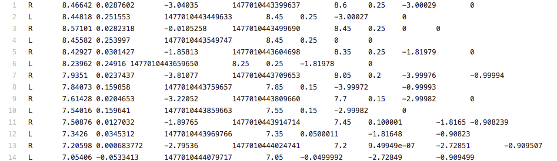

## What You'll Need to Do
1. Read the repo's [README](https://github.com/udacity/CarND-Extended-Kalman-Filter-Project/blob/master/README.md) for more detailed instructions.
2. Complete the Extended Kalman Filter algorithm in C++.
3. Ensure that your project compiles.
    - From the root of the repo:
    ```bash
    mkdir build && cd build
    cmake .. && make
    ./ExtendedKF path/to/input.txt path/to/output.txt
    ```
4. Test your Kalman Filter against the sample data. Ensure that the px, py, vx, and vy RMSE are below the values specified in the rubric.
5. Submit your project!

## Resources for Completing the Project
The project's [GitHub](https://github.com/udacity/CarND-Extended-Kalman-Filter-Project) repository contains all of the files that you will need. The github repository includes:

- two data files for testing your extended Kalman filter
- starter code in the `src` folder
- a `README` file with instructions on compiling the code
- a `Docs` folder, which contains details about the structure of the code templates
- `CMakeLists.txt `file that will be used when compiling your code (you do not need to change this file).

[Here](https://review.udacity.com/#!/rubrics/748/view) is a link to the project rubric. Your project will need to meet specifications for all of the criteria in the rubric.

## Dependencies
Keep in mind that the minimum project dependency versions are:

- cmake: 3.5
    - All OSes: click [here](https://cmake.org/install/) for installation instructions
- make: 4.1
    - Linux: make is installed by default on most Linux distros
    - Mac: [install Xcode command line tools to get make](https://developer.apple.com/xcode/features/)
    - Windows: Click [here](http://gnuwin32.sourceforge.net/packages/make.htm) for installation instructions
- gcc/g++: 5.4
    - Linux: gcc / g++ is installed by default on most Linux distros
    - Mac: same deal as make - [install Xcode command line tools](https://classroom.udacity.com/nanodegrees/nd013/parts/40f38239-66b6-46ec-ae68-03afd8a601c8/modules/0949fca6-b379-42af-a919-ee50aa304e6a/lessons/f758c44c-5e40-4e01-93b5-1a82aa4e044f/concepts/(https://developer.apple.com/xcode/features/)
    - Windows: recommend using [MinGW](http://www.mingw.org/)

## Optional Resources
To complete the project, you only need the files in the github repo; however, we are also providing some extra resources that you can use to develop your solution:

- A Sensor Fusion utilities [repo](https://github.com/udacity/CarND-Mercedes-SF-Utilities) containing Matlab scripts that will generate more sample data (generating your own sample data is completely optional)
- A visualization package that you can also find within the Sensor Fusion utilities [repo](https://github.com/udacity/CarND-Mercedes-SF-Utilities)
- a 2-dimensional Unity simulator for visualizing your results. See the "2-D Unity Simulator" lecture slides for more information.

## Explanation of the Data Files
The github repo contains two data files:

- `sample-laser-radar-measurement-data-1.txt`
- `sample-laser-radar-measurement-data-2.txt`

We have provided two data files so that you can test your Kalman filter using two different simulations. Each data file has the same structure. Here is a screenshot of the first data file:



Each row represents a sensor measurement where the first column tells you if the measurement comes from radar (R) or lidar (L).

For a row containing radar data, the columns are: 
- sensor_type
- rho_measured
- phi_measured
- rhodot_measured
- timestamp
- x_groundtruth
- y_groundtruth
- vx_groundtruth
- vy_groundtruth

For a row containing lidar data, the columns are: 
- sensor_type
- x_measured
- y_measured
- timestamp
- x_groundtruth
- y_groundtruth
- vx_groundtruth
- vy_groundtruth

Whereas radar has three measurements (rho, phi, rhodot), lidar has two measurements (x, y).

You will use the measurement values and timestamp in your Kalman filter algorithm. Groundtruth, which represents the actual path the bicycle took, is for calculating root mean squared error.

## Reading in the Data
We have provided code that will read in and parse the data files for you. This code is in the main.cpp file. The main.cpp file creates instances of a MeasurementPackage and a GroundTruthPackage class.

If you look inside 'main.cpp', you will see code like:
```
MeasurementPackage meas_package;
meas_package.sensor_type_ = MeasurementPackage::LASER;
meas_package.raw_measurements_ = VectorXd(2);
meas_package.raw_measurements_ << x, y;
meas_package.timestamp_ = timestamp;
measurement_pack_list.push_back(meas_package);
```
and
```
GroundTruthPackage gt_package;
gt_package.gt_values_ = VectorXd(4);
gt_package.gt_values_ << x_gt, y_gt, vx_gt, vy_gt;
gt_pack_list.push_back(gt_package);
```
The code reads in the data file line by line. The measurement data for each line gets pushed onto a `measurement_pack_list`. The ground truth for each line in the data file gets pushed onto the list `gt_pack_list`. `main.cpp` contains a for loop that will iterate through these lists simulating what it would be like for a vehicle to receive radar and lidar sensor measurements.

## `main.cpp`
- creating an instance of the `FusionEKF` class
- looping through the measurement data calling the `ProcessMeasurement()` function one measurement at a time. `ProcessMeasurement()` is responsible for the initialization the Kalman filter as well as calling the prediction and update steps of the Kalman filter. You will be implementing the `ProcessMeasurement()` function in `FusionEKF.cpp`:

Finally,

The rest of the for loop in main.cpp will output the following results to a text file:

- the ground truth
- sensor measurements
- your filter's belief about location and velocity

Here is the `main.cpp` code that outputs the results into a text file:
```
    // output the estimation
    out_file_ << fusionEKF.ekf_.x_(0) << "\t";
    out_file_ << fusionEKF.ekf_.x_(1) << "\t";
    out_file_ << fusionEKF.ekf_.x_(2) << "\t";
    out_file_ << fusionEKF.ekf_.x_(3) << "\t";

    // output the measurements
    if (measurement_pack_list[k].sensor_type_ == MeasurementPackage::LASER) {
      // output the estimation
      out_file_ << measurement_pack_list[k].raw_measurements_(0) << "\t";
      out_file_ << measurement_pack_list[k].raw_measurements_(1) << "\t";
    } else if (measurement_pack_list[k].sensor_type_ == MeasurementPackage::RADAR) {
      // output the estimation in the cartesian coordinates
      float ro = measurement_pack_list[k].raw_measurements_(0);
      float phi = measurement_pack_list[k].raw_measurements_(1);
      out_file_ << ro * cos(phi) << "\t"; // p1_meas
      out_file_ << ro * sin(phi) << "\t"; // ps_meas
    }

    // output the ground truth packages
    out_file_ << gt_pack_list[k].gt_values_(0) << "\t";
    out_file_ << gt_pack_list[k].gt_values_(1) << "\t";
    out_file_ << gt_pack_list[k].gt_values_(2) << "\t";
    out_file_ << gt_pack_list[k].gt_values_(3) << "\n";
```

You can then use this output file to visualize your results. Visualizing your results is not required for passing the project.

The for loop also stores the ground truth and your Kalman filter's location and velocity information to a `ground_truth` list and an `estimations` list:
```
    estimations.push_back(fusionEKF.ekf_.x_);
    ground_truth.push_back(gt_pack_list[k].gt_values_);
```
Once the for loop finishes, `main.cpp` will call a function to calculate root mean squared error:
```
  // compute the accuracy (RMSE)
  Tools tools;
  cout << "Accuracy - RMSE:" << endl << tools.CalculateRMSE(estimations, ground_truth) << endl;
```

You will implement an RMSE function in the `tools.cpp` file.

### Summary of main.cpp
In summary, main.cpp:

- reads in the data file and stores the data into ground truth and sensor measurement lists.
- iterates through the data sending each sensor measurement to the Kalman filter
- stores the ground truth and kalman Filter position and velocity in lists
- outputs RMSE

## Project Code
### `FusionEKF.cpp`
In `FusionEKF.cpp`, we have given some starter code for implementing sensor fusion. In this file, you won't need to include the actual Kalman filter equations; instead, you will be initializing variables, initializing the Kalman filters, and then calling functions that implement the prediction step or update step. You will see `TODO` comments indicating where to put your code.

You will need to:

1. initialize variables and matrices (x, F, H_laser, H_jacobian, P, etc.)
2. initialize the Kalman filter position vector with the first sensor measurements
3. modify the F and Q matrices prior to the prediction step based on the elapsed time between measurements
4. call the update step for either the lidar or radar sensor measurement. Because the update step for lidar and radar are slightly different, there are different functions for updating lidar and radar.

### Initializing Variables in FusionEKF.cpp
```
  // initializing matrices
  R_laser_ = MatrixXd(2, 2);
  R_radar_ = MatrixXd(3, 3);
  H_laser_ = MatrixXd(2, 4);
  Hj_ = MatrixXd(3, 4);

  //measurement covariance matrix - laser
  R_laser_ << 0.0225, 0,
        0, 0.0225;

  //measurement covariance matrix - radar
  R_radar_ << 0.09, 0, 0,
        0, 0.0009, 0,
        0, 0, 0.09;

  /**
  TODO:
    * Finish initializing the FusionEKF.
    * Set the process and measurement noises
  */
```
Every time `main.cpp` calls `fusionEKF.ProcessMeasurement(measurement_pack_list[k])`, the code in `FusionEKF.cpp` will run. - If this is the first measurement, the Kalman filter will try to initialize the object's location with the sensor measurement.

### Initializing the Kalman Filter in FusionEKF.cpp
```
   /*****************************************************************************
   *  Initialization
   ****************************************************************************/
  if (!is_initialized_) {
    /**
    TODO:
      * Initialize the state ekf_.x_ with the first measurement.
      * Create the covariance matrix.
      * Remember: you'll need to convert radar from polar to cartesian coordinates.
    */
    // first measurement
    cout << "EKF: " << endl;
    ekf_.x_ = VectorXd(4);
    ekf_.x_ << 1, 1, 1, 1;

    if (measurement_pack.sensor_type_ == MeasurementPackage::RADAR) {
      /**
      Convert radar from polar to cartesian coordinates and initialize state.
      */
    }
    else if (measurement_pack.sensor_type_ == MeasurementPackage::LASER) {
      /**
      Initialize state.
      */
    }

    // done initializing, no need to predict or update
    is_initialized_ = true;
    return;
  }
```

### Predict and Update Steps in `FusionEKF.cpp`
Once the Kalman filter gets initialized, the next iterations of the for loop will call the `ProcessMeasurement()` function to do the predict and update steps.
```
   /*****************************************************************************
   *  Prediction
   ****************************************************************************/

  /**
   TODO:
     * Update the state transition matrix F according to the new elapsed time.
      - Time is measured in seconds.
     * Update the process noise covariance matrix.
     * Use noise_ax = 9 and noise_ay = 9 for your Q matrix.
   */

  ekf_.Predict();

  /*****************************************************************************
   *  Update
   ****************************************************************************/

  /**
   TODO:
     * Use the sensor type to perform the update step.
     * Update the state and covariance matrices.
   */

  if (measurement_pack.sensor_type_ == MeasurementPackage::RADAR) {
    // Radar updates
  } else {
    // Laser updates
  }
```
In `FusionEKF.cpp`, you will see references to a variable called `ekf_`. The `ekf_` variable is an instance of the `KalmanFilter` class. You will use `ekf_` to store your Kalman filter variables (x, P, F, H, R, Q) and call the predict and update functions. Let's talk more about the KalmanFilter class.

### KalmanFilter Class
`kalman_filter.h` defines the `KalmanFilter` class containing the x vector as well as the P, F, Q, H and R matrices. The KalmanFilter class also contains functions for the prediction step as well as the Kalman filter update step (lidar) and extended Kalman filter update step (radar).

You will need to add your code to `kalman_filter.cpp` to implement the prediction and update equations. You do not need to modify 'kalman_filter.h'.

Because lidar uses linear equations, the update step will use the basic Kalman filter equations. On the other hand, radar uses non-linear equations, so the update step involves linearizing the equations with the Jacobian matrix. The `Update` function will use the standard Kalman filter equations. The `UpdateEKF` will use the extended Kalman filter equations:
```
void KalmanFilter::Predict() {
  /**
  TODO:
    * predict the state
  */
}

void KalmanFilter::Update(const VectorXd &z) {
  /**
  TODO:
    * update the state by using Kalman Filter equations
  */
}

void KalmanFilter::UpdateEKF(const VectorXd &z) {
  /**
  TODO:
    * update the state by using Extended Kalman Filter equations
  */
}
```

### `Tools.cpp`
This file is relatively straight forward. You will implement functions to calculate root mean squared error and the Jacobian matrix:
```
VectorXd Tools::CalculateRMSE(const vector<VectorXd> &estimations,
                              const vector<VectorXd> &ground_truth) {
  /**
  TODO:
    * Calculate the RMSE here.
  */
}
MatrixXd Tools::CalculateJacobian(const VectorXd& x_state) {
  /**
  TODO:
    * Calculate a Jacobian here.
  */
}
```
> __HINT:__ You implemented these already in the coding quizzes.

### Compiling and Running Your Code
Take a look at the github repo [README](https://github.com/udacity/CarND-Extended-Kalman-Filter-Project/blob/master/README.md) file for instructions on how to compile and run your code.

### Summary of What Needs to Be Done
1. In `tools.cpp`, fill in the functions that calculate root mean squared error (RMSE) and the Jacobian matrix.
2. Fill in the code in `FusionEKF.cpp`. You'll need to initialize the Kalman Filter, prepare the Q and F matrices for the prediction step, and call the radar and lidar update functions.
3. In `kalman_filter.cpp`, fill out the `Predict()`, `Update()`, and `UpdateEKF()` functions.

## Tips and Tricks
- Review the previous lessons! Andrei, Dominik and co. have given you everything you need. In fact, you've built most of an Extended Kalman Filter already! Take a look at the programming assignments and apply the techniques you used to this project.
- The R matrix values and Q noise values are provided for you. There is no need to tune these parameters for this project. In the unscented Kalman Filter lectures, we'll discuss how to determine these parameters.
- For lidar measurements, the error equation is `y = z - H * x'`. For radar measurements, the functions that map the x vector [px, py, vx, vy] to polar coordinates are non-linear. Instead of using H to calculate `y = z - H * x'`, for radar measurements you'll have to use the equations that map from cartesian to polar coordinates: `y = z - h(x')`.
- In C++, `atan2()` returns values between -pi and pi. When calculating phi in `y = z - h(x)` for radar measurements, the resulting angle phi in the y vector should be adjusted so that it is between -pi and pi. The Kalman filter is expecting small angle values between the range -pi and pi. 
    > __HINT:__ when working in radians, you can add 2π or subtract 2π until the angle is within the desired range.
- Before and while calculating the Jacobian matrix Hj, make sure your code avoids dividing by zero. For example, both the x and y values might be zero or `px * px + py * py` might be close to zero. What should be done in those cases?
- In `sample-laser-radar-measurement-data-2.txt`, the starting lidar measurements for x, y are both zero, and this special case can create problems for both the EKF and UKF lidar update states, in particular for the EKF when calculating the Jacobian. One way to catch for this is to observe when both px, py are zero and instead set them to some small floating value. You could also skip the update step and go directly to another prediction step.
- Test! We're giving you the ability to visualize your estimations and calculate RMSE. As you make changes, keep testing your algorithm!
- Try removing radar or lidar data from the filter. Observe how your estimations change when running against a single sensor type! Do the results make sense given what you know about the nature of radar and lidar data? Download the Kalman filter visualizer. You can find more information about the visualizer the in the "2-D Unity Visualizer" lecture notes.